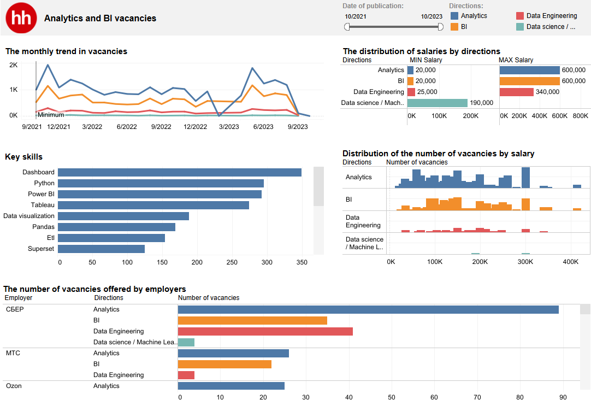
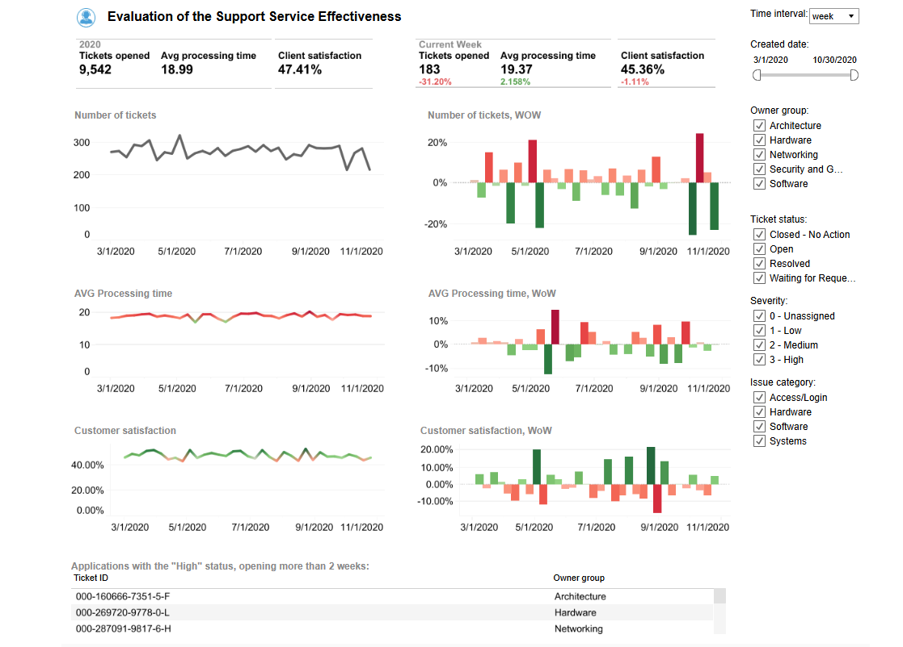

## **Привет! :)**

В этом блоке представлены несколько моих дашбордов, выполненных в Tableau:

* **Отчет о продажах на основе данных Sample_Superstore**
* **Дашборд с визуализацией данных о вакансиях аналитиков, размещенных на HH.ru**
* **Customer Success Overview**

---
## Отчет о продажах на основе данных Sample_Superstore

Данный dashboard визуализирует [датасет Sample_Superstore](javascript:void(0);)

Сам dashboard можно посмотреть по данной [ссылке](https://public.tableau.com/views/SalesReport_17177962739020/Dashboard1?:language=en-US&:sid=&:redirect=auth&:display_count=n&:origin=viz_share_link)

Дашборд визуализирует данные о выручке магазина с 1 января 2016 года по 1 декабря 2019 года. Данные о выручке представлены в разрезах по категориям товаров и по регионам. Есть возможность фильтрации данных за необходимый временной промежуток.

---
## Дашборд с визуализацией данных о вакансиях аналитиков, размещенных на HH.ru

Данный dashboard визуализирует [датасет](https://disk.yandex.ru/d/MnBnw-MYAk1tHA)

Сам dashboard можно посмотреть по данной [ссылке](https://public.tableau.com/views/Vacancies_17179334921090/Dashboard1?:language=en-US&:sid=&:redirect=auth&:display_count=n&:origin=viz_share_link)

Датасет представляет собой данные с вакансиями аналитиков (датасет), которые нашлись по какому-то ключевому запросу на сайте со следующими полями:

Описание полей:

* **archived** — актуальная или в архиве
* **area_name** — название региона 
* **direction** — направление аналитики для ключевого слова
* **employer_name** — название работодателя 
* **level** — уровень позиции
* **name** — название вакансии
* **published_at** — дата публикации 
* **query_string** — поисковый запрос
* **type** — тип поискового запроса (навык/профессия)
* **url** — ссылка на вакансию
* **vacancy_id** — id вакансии
* **lat** — координаты вакансии, широта
* **lng** — координаты вакансии, долгота
* **employer_id** — id работодателя 
* **salary, net** — средняя зарплата в указной вилке после вычета налога
* **salary_from** — минимальное значение зарплаты в вилке
* **salary_gross_flag** — 0 — вилка указана net, 1 — вилка указана gross.
* **salary_to** — максимальное значение зарплаты в вилке

Дашборд визуализирует данные о выручке магазина с октября 2021 года октябрь 2023 года. 

Построенная визуализация данных отвечает на слеующие вопросы:
1. Как изменяется кол-во вакансий по месяцам?
2. Какие навыки наиболее востребованы работодателями?
3. Кто является самыми крупными работодателями?
4. Как распределяется кол-во вакансий по зарплатам?
5. Какой разброс зарплат по разным профессиям?

---
## Customer Success Overview

Данный dashboard визуализирует [датасет](https://data.world/markbradbourne/rwfd-real-world-fake-data/workspace/file?filename=Help+Desk.csv)

Сам dashboard можно посмотреть по данной [ссылке](https://public.tableau.com/views/Supportservice/Dashboard1?:language=en-US&:sid=&:redirect=auth&:display_count=n&:origin=viz_share_link)

Датасет представляет собой данные о работе клиентской поддержки в сети отелей. Есть пять основных команд, между которыми распределяются тикеты (заявка в службу поддержки, далее тикет), каждая из них отвечает за свою часть проблем.  При возникновении проблемы пользователь через форму оставляет обращение в службу поддержки. Система регистрирует обращение и распределяет по группам ответственных, после решения запроса пользователь выставляет оценку службе поддержки.

Описание полей:

* **ticket_number**: номер тикета (заявки в службу поддержки);
* **requestor_fname**: имя заявителя;
* **requestor_lname**: фамилия заявителя;
* **owner_group**: группа ответственных;
* **issue_category**: категория проблемы ;
* **ticket_type**: тип заявки;
* **severity**: уровень серьезности проблемы;
* **days_open**: количество дней, прошедших с момента открытия заявки, посчитано на дату выгрузки;
* **satisfaction_score**: оценка удовлетворенности от 1 до 3;
* **ticket_status**: статус заявки (текстовое значение);
* **created_date**: дата создания заявки (дата и время).

Дашборд позволяет ответить на следующие вопросы:

1. Какое общее количество открытых тикетов?
2. Сколько открытых тикетов за последнюю неделю/за все время? 
3. Среднее время обработки тикета (в днях) за последнюю неделю/за все время?
4. Доля удовлетворенных клиентов после закрытия тикета (доля людей, оценивших результат заявки на 3 и 2) за последнюю неделю/за все время?
5. Список зависших (открытых) тикетов с высоким уровнем серьезности.
Есть возможность фильтрации данных по категории проблемы, уровню серьезности проблемы, группе ответственных и статусу заявки.

